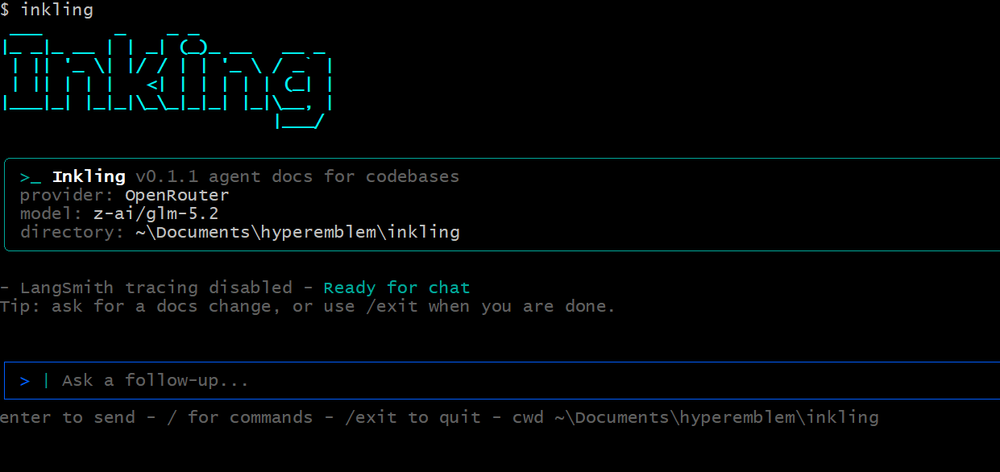

# Inkling

Inkling is a CLI that writes, maintains, exports, and validates documentation for your codebase — built specifically for coding agents and the humans who work alongside them.



[](https://github.com/nitingpt000/inkling/actions/workflows/checks.yml)
[](https://www.npmjs.com/package/inkling)
[](./LICENSE)

> Inkling is a community fork of [langchain-ai/openwiki](https://github.com/langchain-ai/openwiki) with a static-site exporter, Mermaid diagrams, a local Ollama provider, and built-in wiki search & validation.

## What it does

A [DeepAgents](https://github.com/langchain-ai/deepagents) documentation agent inspects your repository — source, git history, existing docs — and produces a navigable Markdown wiki under `inkling/` that stays useful for both humans and future agents. Then Inkling gives you tooling around that wiki:

- **Generate & maintain** — `--init` builds the wiki; `--update` keeps it current from repo changes.
- **Mermaid diagrams** — the agent renders architecture and flow diagrams inline where they add clarity.
- **Static site export** — `inkling export` turns the wiki into a self-contained HTML site with sidebar navigation, client-side search, and live Mermaid rendering. Host it on GitHub Pages.
- **Search** — `inkling search <query>` greps the wiki from your terminal.
- **Validate** — `inkling validate` flags broken internal links and orphan pages.
- **Bring your own model** — OpenRouter, Anthropic, OpenAI, Fireworks, Baseten, any OpenAI-compatible gateway, or a fully local **Ollama** server (no API key required).

## Install

```sh
npm install -g inkling
```

## Quick start

Initialize Inkling, configure your model and API key, then generate documentation:

```sh
inkling --init
```

Keep the docs fresh by adding the scheduled GitHub Action from
[examples/inkling-update.yml](./examples/inkling-update.yml) to
`.github/workflows/inkling-update.yml` in your repository. It opens a PR with
documentation updates on a schedule.

## Usage

```sh
inkling                     # interactive chat
inkling "document the API"  # send an initial request, then stay open
inkling -p "Summarize what you can do"   # one-shot, print, exit
inkling --init              # generate initial documentation
inkling --update            # update existing documentation
inkling export [dir]        # render the wiki to a static HTML site (default: inkling-site)
inkling search <query>      # search the generated wiki
inkling validate            # check for broken links and orphan pages
inkling --help              # full usage
```

`inkling` creates initial documentation in `inkling/` when no wiki exists, and
refreshes it from repository changes when it does. By default the CLI stays open
after each run for follow-up messages; use `-p`/`--print` for a one-shot
non-interactive run.

Inkling automatically appends a reference section to your `AGENTS.md` and/or
`CLAUDE.md` so your coding agent knows to consult the wiki for context, creating
the file if it does not exist.

On the first interactive run, Inkling walks you through configuring your
inference provider, API key, model, and an optional LangSmith key for tracing.
These settings are stored in `~/.inkling/.env` on your machine.

## Exporting a static site

```sh
inkling export            # writes ./inkling-site
inkling export ./docs     # custom output directory
```

The generated site is fully static (HTML + CSS + a tiny JS bundle). Open
`inkling-site/index.html` locally, or publish the folder with GitHub Pages.
Mermaid diagrams render in the browser; client-side search works with no server.

## Providers & models

Inkling supports OpenRouter, Ollama, Baseten, Fireworks, OpenAI, an
OpenAI-compatible provider, and Anthropic out of the box, each with a few
predefined models plus a custom model ID option.

### Ollama (local, free, no API key)

Run a model entirely on your machine with [Ollama](https://ollama.com):

```sh
ollama pull qwen2.5-coder:7b
```

```bash
INKLING_PROVIDER=ollama
INKLING_MODEL_ID=qwen2.5-coder:7b
# optional — defaults to http://localhost:11434/v1
OLLAMA_BASE_URL=http://localhost:11434/v1
```

### Anthropic (with optional alternative base URL)

```bash
INKLING_PROVIDER=anthropic
ANTHROPIC_API_KEY=your-key
ANTHROPIC_BASE_URL=https://your-gateway.example.com/anthropic
```

### OpenAI-compatible endpoints

Target any OpenAI-compatible chat-completions endpoint (for example a LiteLLM
gateway) via a required base URL:

```bash
INKLING_PROVIDER=openai-compatible
OPENAI_COMPATIBLE_API_KEY=your-gateway-key
OPENAI_COMPATIBLE_BASE_URL=https://your-gateway.example.com/v1
INKLING_MODEL_ID=your-gateway-model-name
```

Base URLs and credentials can be set in your environment or stored in
`~/.inkling/.env`.

## Documentation

Full guides live in [`docs/`](./docs/README.md):

- [Commands](./docs/commands.md) — every command and flag.
- [Providers & models](./docs/providers.md) — OpenRouter, Ollama, Anthropic,
  OpenAI, and gateways.
- [Static site export](./docs/static-site.md) — generating and hosting a site.
- [Architecture](./docs/architecture.md) — how Inkling is built.
- [Testing](./docs/testing.md) — the unit and E2E suites.

## Contributing

Contributions are welcome — see [CONTRIBUTING.md](./CONTRIBUTING.md) and
[DEVELOPMENT.md](./DEVELOPMENT.md) to get started. Please also review the
[Code of Conduct](./CODE_OF_CONDUCT.md) and [Security policy](./SECURITY.md). If
there's a provider or model you'd like added, open an issue or PR.

## Testing

```sh
pnpm test              # unit + e2e
pnpm run test:coverage # with coverage report
```

See [docs/testing.md](./docs/testing.md) for how the suite is organized.

## Credits

Inkling builds on [OpenWiki](https://github.com/langchain-ai/openwiki) by
LangChain and the [DeepAgents](https://github.com/langchain-ai/deepagents)
framework. Licensed under [MIT](./LICENSE).
