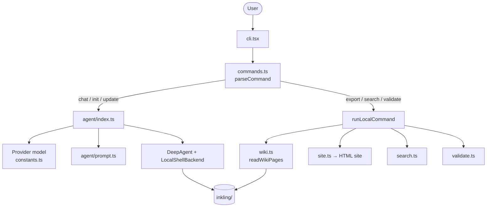

# Architecture

Inkling is a TypeScript CLI (Node.js ≥ 20, ESM) with two responsibilities:

1. Run a [DeepAgents](https://github.com/langchain-ai/deepagents) documentation
   agent that reads a repository and writes a Markdown wiki.
2. Provide local tooling over that wiki: export, search, and validate.

## High-level flow

Agent commands need a configured provider and credentials; local commands read
`inkling/` directly and never touch the model, credentials, or network.

## Module map

| Module                | Responsibility                                                 |
| --------------------- | -------------------------------------------------------------- |
| `src/cli.tsx`         | Entry point, Ink/React UI, and top-level command dispatch.     |
| `src/commands.ts`     | Argument parsing (`parseCommand`) and help text.               |
| `src/constants.ts`    | Provider registry, model IDs, env-key definitions, validators. |
| `src/credentials.tsx` | First-run interactive setup flow.                              |
| `src/env.ts`          | Read/write `~/.inkling/.env`.                                  |
| `src/agent/index.ts`  | Build the model, run the DeepAgent, stream events, fallbacks.  |
| `src/agent/prompt.ts` | System and user prompts, including Mermaid and mode rules.     |
| `src/agent/utils.ts`  | Run context, git summary, update no-op detection, snapshots.   |
| `src/wiki.ts`         | Shared reader for the `inkling/` Markdown wiki.                |
| `src/site.ts`         | Static HTML site exporter.                                     |
| `src/search.ts`       | Wiki search.                                                   |
| `src/validate.ts`     | Link and orphan-page validation.                               |

## The documentation agent

`runInklingAgent` (in `src/agent/index.ts`):

1. Loads `~/.inkling/.env` and resolves the provider, model, and credentials.
2. For `--update`, short-circuits if git shows no changes since the last run.
3. Constructs a provider-specific chat model. Keyless providers (Ollama) receive
   a placeholder key to satisfy the OpenAI-compatible client.
4. Creates a DeepAgent with a `LocalShellBackend` rooted at the target repo and
   a system prompt tailored to the command mode (chat/init/update).
5. Streams model and tool events back to the UI, then records run metadata in
   `inkling/.last-update.json` when the wiki changed.

OpenRouter runs additionally route through a small fallback list on transient
5xx errors.

## Local commands

The `export`, `search`, and `validate` subcommands are pure, offline functions.
They share `readWikiPages` (`src/wiki.ts`), which walks `inkling/`, skips
metadata/scratch files (`.last-update.json`, `_plan.md`, dotfiles), derives a
title per page, and returns pages sorted with `quickstart.md` first. This keeps
them fast, deterministic, and easy to test without a model.

## Conventions

- ESM only. Import local modules with the `.js` extension even from `.ts`
  sources — that is what `tsc` emits and what Node resolves at runtime.
- The brand is spelled `Inkling` / `inkling`; environment variables are prefixed
  `INKLING_`.
- Keep local commands free of model, credential, and network dependencies.
